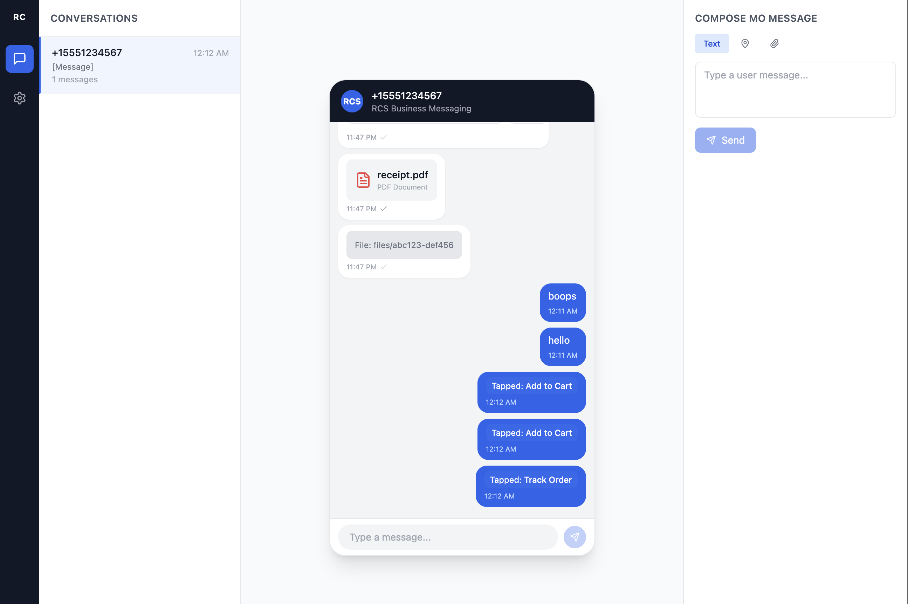

# RCStrap

A local RCS Business Messaging test server. Simulates Google's RCS platform so you can develop and test RCS agents without hitting production APIs.

Receives agent messages via Google-compatible endpoints, validates them against the full RCS spec, renders them in a phone-like preview UI, and sends simulated user messages and delivery reports back to your agent's webhook.



## Quick Start

```bash
docker compose up
```

Dashboard at [http://localhost:3000](http://localhost:3000). Point your agent's RCS API base URL to `http://localhost:3000`.

## What It Does

**Google-compatible API surface** — drop-in replacement for the RCS Business Messaging API:

| Method | Endpoint | Purpose |
|--------|----------|---------|
| POST | `/v1/phones/{phone}/agentMessages` | Send agent message |
| DELETE | `/v1/phones/{phone}/agentMessages/{id}` | Revoke message |
| POST | `/v1/phones/{phone}/agentEvents` | Send IS_TYPING / READ events |
| POST | `/v1/files` | Create file from URL |
| POST | `/upload/v1/files` | Upload file (multipart) |
| GET | `/v1/phones/{phone}/capabilities` | Query device capabilities |
| POST | `/v1/users:batchGet` | Batch capability check |
| POST | `/v1/phones/{phone}/testers` | Invite tester |

**Full RCS message validation** — rejects invalid payloads with Google-style error responses:

- Text (max 3072 chars), rich cards (standalone + carousel), media, suggestions (reply + 5 action types)
- Content type exclusivity, suggestion limits (11 per message, 4 per card, 25 chars each)
- Traffic types, TTL/expireTime mutual exclusion, E.164 phone format, 250KB payload limit
- Carousel rules (2–10 cards), horizontal cards require media, card content requirements

**Interactive dashboard** — acts like a real device:

- Phone-style message preview with bubbles, rich cards, carousels, images, video, delivery checkmarks
- Tap suggestion chips and action buttons (opens URLs, dials, maps, calendar events, location sharing)
- Send text messages, files, locations, and suggestion taps as the simulated user
- Real-time updates via WebSocket

**Simulated delivery reports** — configurable percentage-based DELIVERED/READ reports sent to your webhook with IS_TYPING indicators.

## Configuration

All settings configurable via environment variables, the settings UI, or both. UI overrides take priority and persist to the database.

| Variable | Default | Description |
|----------|---------|-------------|
| `PORT` | `3000` | Server port |
| `WEBHOOK_URL` | `http://localhost:8080/webhook` | Your agent's webhook URL |
| `WEBHOOK_TIMEOUT_MS` | `5000` | Webhook request timeout |
| `DELIVERY_REPORT_DELIVERED_PCT` | `80` | % of messages that get DELIVERED |
| `DELIVERY_REPORT_READ_PCT` | `10` | % of delivered messages that get READ |
| `DELIVERY_REPORT_IS_TYPING_ENABLED` | `true` | Send IS_TYPING before delivery reports |
| `DELIVERY_REPORT_DELAY_MS` | `1000` | Delay before sending reports |
| `AGENT_ID` | `rcstrap-test-agent` | Agent ID in webhook payloads |
| `DB_PATH` | `./data/rcstrap.sqlite` | SQLite database path |

## Development

Requires Node.js 22+ and pnpm.

```bash
pnpm install
pnpm dev:all
```

This starts the NestJS server on port 3000 and the Vite dev server on port 5173 (with API proxy to 3000).

## Architecture

Single container, pnpm monorepo.

- **`packages/server`** — NestJS, Drizzle ORM, better-sqlite3, Socket.IO
- **`packages/web`** — React 19, Vite, Tailwind CSS, Zustand, TanStack Query

```
Browser (React) ──REST + WebSocket──▶ NestJS Server ──webhook──▶ Your Agent
                                          │
                                       SQLite
```

## Example

Send a rich card to the test server:

```bash
curl -X POST http://localhost:3000/v1/phones/%2B15551234567/agentMessages \
  -H 'Content-Type: application/json' \
  -d '{
    "messageId": "msg-001",
    "text": "Hello from my agent!",
    "suggestions": [
      {"reply": {"text": "Hi!", "postbackData": "greeting"}},
      {"action": {"text": "Visit", "postbackData": "url", "openUrlAction": {"url": "https://example.com"}}}
    ]
  }'
```

Open the dashboard to see it rendered in the phone preview. Type a reply or tap a suggestion chip — it posts to your webhook.

## License

MIT
